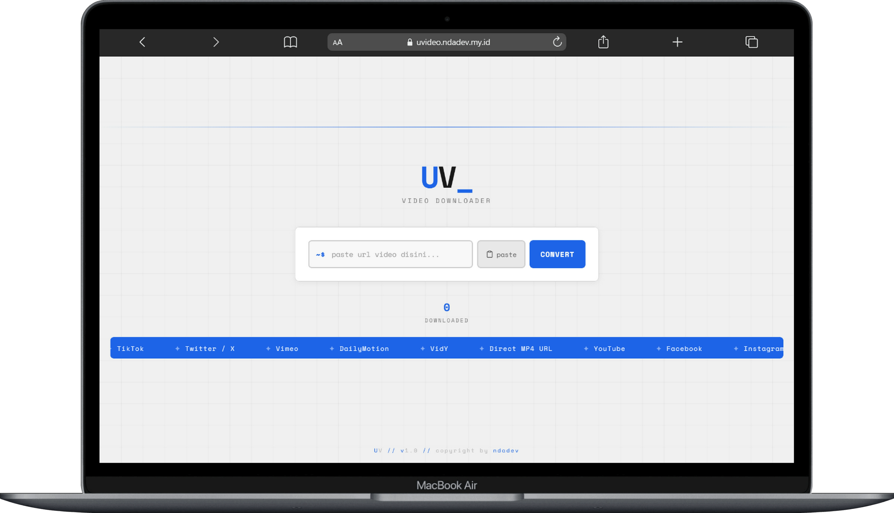
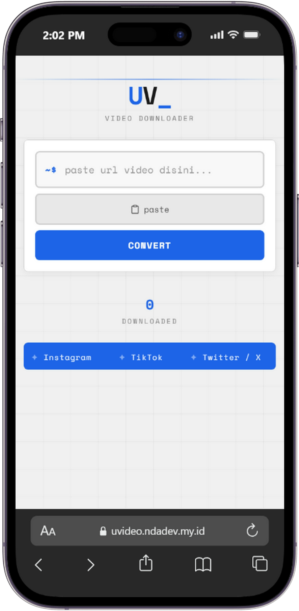

<h1 align="center">uvideo</h1>

<p align="center">
  Download video dari YouTube, TikTok, Facebook, Instagram, dan situs lainnya.<br>
  Tinggal paste link, pilih format, langsung download.
</p>

<p align="center">
  <a href="https://uvideo.ndadev.my.id/">Live Demo</a> · 
  <a href="https://github.com/ndadevdev/uvideo/issues">Report Bug</a> · 
  <a href="https://github.com/ndadevdev/uvideo/issues">Request Feature</a>
</p>

<p align="center">
  
</p>

<p align="center">
  
</p>

### Fitur

- **Auto detect platform** paste aja link-nya, otomatis kenali YouTube/TikTok/Instagram/dll
- **TikTok tanpa watermark** langsung ambil video tanpa watermark
- **YouTube 720p** ambil resolusi terbaik yang tersedia
- **vdy.to support** handle HLS streams, download segment paralel
- **Preview video** sebelum download, bisa play langsung di browser
- **Responsive** bisa dipakai dari HP maupun desktop

### Cara Pakai

**Online**
1. Buka link demo
2. Paste URL video
3. Klik `convert`
4. Tunggu sebentar, preview akan muncul
5. Klik `Download`

**CLI**
```bash
python download.py "https://www.tiktok.com/..." -o video.mp4
```

### Platform yang Didukung

| Platform | Status | Catatan |
|----------|--------|---------|
| YouTube | Working | Ambil langsung dari CDN |
| TikTok | Working | Via tikwm API, tanpa watermark |
| vdy.to | Working | HLS, segment paralel |
| Direct URL | Working | .mp4, .webm, dll |
| Facebook | Limited | Butuh login untuk beberapa video |
| Instagram | Limited | Reels & post butuh autentikasi |
| Twitter/X | Limited | Beberapa video butuh login |

### Tech Stack

- **Frontend** HTML, CSS vanilla, JavaScript
- **Backend** Python (Vercel Serverless Function)
- **API** tikwm.com (TikTok), yt-dlp (YouTube dll)

### Project Structure

```
uvideo/
├── index.html          # Web UI
├── api/
│   └── download.py     # Vercel serverless function
├── download.py         # CLI tool
├── vercel.json         # Vercel config
├── requirements.txt    # Python dependencies
└── .gitignore
```

### Local Development

```bash
# Install dependencies
pip install requests

# CLI
python download.py "https://youtube.com/watch?v=..."

# Web (butuh Vercel CLI)
vercel dev
```

### Known Issues

- Instagram & Facebook butuh autentikasi untuk download video tertentu
- Format output dari vdy.to berupa .ts (MPEG-TS), playable di VLC dan browser modern

### License

MIT

---

Dibuat oleh [ndadev](https://github.com/ndadevdev) & [OpenCode](https://opencode.ai) 🤙
